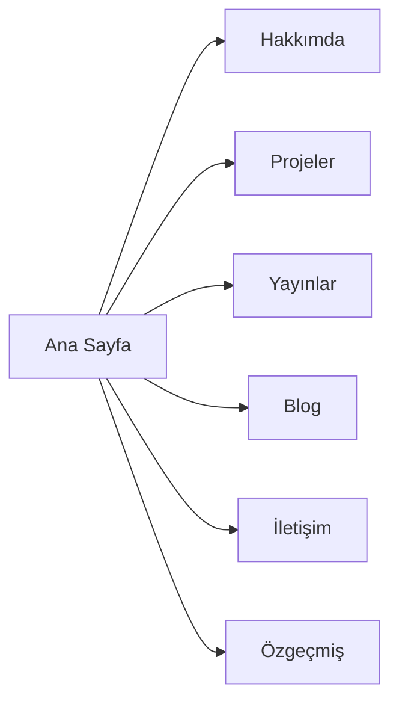
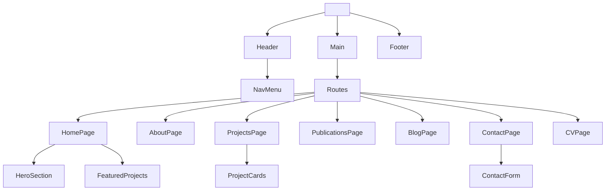

# Vite + React Kişisel Web Sitesi Şablonu Tasarım Planı

## Yönetici Özeti  
Bu plan, **Vite + React** ile hayata geçirilecek Burak Akçakanat’ın kişisel web sitesi şablonunu detaylıca tarif eder. Şablonun renk paleti olarak lacivert, mavi ve nefti yeşil tonları kullanılacak; okunaklı sans-serif tipografi seçilecek; özgün fakat profesyonel bir görsel dili benimsenecektir. Tüm bölümler erişilebilirlik (WCAG, semantik etiketler) ve mobil uyumluluk prensiplerine uygun tasarlanacak. SEO için sayfa başlıkları, açıklama meta etiketleri, site haritası ve robots.txt dosyaları oluşturulacak. Performans optimizasyonu için sayfalar statik oluşturulacak (SSG/SSR) ve görüntüler WebP gibi modern formatlara dönüştürülecektir. Veri gizliliği kapsamında sadece zorunlu çerezler kullanılacak ve KVKK/GDPR bildirimi eklenecektir. Örnek sitelerden (ör. Qualtron Sinclair’ın etkileyici kahraman bölümü) ilham alınarak “Hero”, “Hakkında”, “Projeler”, “Yayınlar”, “Blog”, “İletişim”, “Özgeçmiş” gibi bölümler planlanmıştır. Aşağıda tüm bölümler detaylandırılmıştır.

## Örnek Site İncelemeleri ve Tasarım Örüntüleri  
- **Qualtron Sinclair:** Ana sayfanın kahraman bölümünde çarpıcı bir başlık (“We Design the Structure Behind Growth”) ve altta kısa bir açıklama ile öne çıkılıyor. Bu örnek, bizim için etkileyici bir *hero* düzeni sunuyor. Biz de Burak Akçakanat’ın adını, vasfını ve kısa bir slogan/istek çağrısını (örn. *“Girişimlerin Büyümesine Rehberlik Ediyorum”*) benzer biçimde koyabiliriz.  
- **LinkedIn Profilleri:** LinkedIn tarzı profillerin “Hakkında”, “Deneyimler”, “Projeler” gibi bölümleri, site için fikir verici. Örneğin öne çıkan beceriler ve yayınlar LinkedIn’e benzer kart veya liste düzeninde gösterilebilir. Sosyal bağlantılar (LinkedIn, Twitter vs.) belirgin bir yerde yer almalı.  
- **Shaman Life & Human Consciousness Decoded:** Bu sitelerin (Burak Akçakanat’ın diğer platformları) genelinde rahatlatıcı renkler, sakin öğeler ve kişisel dokunuşlar var. *Görsel Stil* bölümünde bahsedildiği gibi mistik, derin hissiyat veren imgeler kullanılabilir.  
- **Genel:** Tüm örneklerden çıkarılacak ders, her sayfada net bir başlık ve alt başlık kullanmak, bölümler arası akışı sağlam tutmak, ve kullanıcıyı eyleme teşvik eden (Özgeçmiş indir, iletişim formu gönder vb.) ögeler eklemektir.  

## Renk Paleti ve Görsel Stil  
 Temel renk paleti lacivert (#001f3f), koyu mavi ve nefti yeşil (#008080 gibi) tonlarından oluşacak. Bu tonlar hem profesyonellik hem de doğayla bağ hissi verir. İlaveten vurgulama için açık mavi veya gri tonları kullanılabilir. Görsel üslupta doğa ve teknoloji dengesi aranacak: örneğin, deniz dalgalarını andıran soyut grafikler veya su altı-misket “gradient” geçişleri tercih edilebilir. Yukarıdaki görselde olduğu gibi lacivert-ten rengi mavi geçişleri, dinamik ve akıcı bir arka plan atmosferi yaratır. Görseller yüksek çözünürlüklü, temiz ve canlı olacak; renkler palet ile uyumlu seçilecek. Tüm resimlere açıklayıcı **alt metin** eklenerek erişilebilirlik sağlanacak. 

## Erişilebilirlik ve Duyarlı Tasarım  
Site tüm cihazlarda uyumlu olacak. Modern tarayıcılar için *mobile-first* yaklaşımla CSS Grid/Flexbox kullanılmalı. Metinler okunaklı puntolarla yazılmalı ve kontrast WCAG AA standartlarını geçmelidir. Tüm bölümler `<header>`, `<nav>`, `<main>`, `<section>`, `<article>`, `<footer>` gibi semantik etiketlerle yapılandırılacak. Görseller için mutlaka açıklayıcı alt metin konulacak. Form öğeleri etiketlerle ve uygun `aria-` özellikleriyle işaretlenecek. Menü, düğme vb. interaktif öğeler klavye ile erişilebilir olacak. 

## SEO ve Performans  
- **Meta Etiketler ve Schema:** Her sayfada özelleştirilmiş `<title>` ve `<meta name="description">` kullanılacak. Örneğin React içinde `react-helmet-async` ile sayfa bileşenlerinde `<Helmet>` aracılığıyla başlık/desc belirlenebilir. Ayrıca Schema.org JSON-LD yapılandırması eklenebilir. Dinamik meta etiketleme ve temel Schema desteği, SEO görünürlüğünü artırır.  
- **Site Haritası (sitemap.xml):** Tüm önemli sayfaları içeren bir sitemap oluşturulacak, böylece arama motorları siteyi daha etkin tarar. `robots.txt` dosyasında bu sitemap’ın adresi belirtilecek ve gerekirse gizli sayfalar hariç tutulacak.  
- **Önceden Oluşturma (SSG/SSR):** İçerik çoğunlukla statik olduğundan **Static Site Generation** (örneğin `vite-ssg`) veya en azından sayfaların build öncesi HTML üretimi tercih edilebilir. Bu, sayfaların hızlı yüklenmesini ve SEO puanının yükselmesini sağlayacaktır.  
- **Görsel Optimizasyonu:** Tüm resimler uygun boyutlandırılacak ve WebP formatına dönüştürülecek. Lazy-loading (tembel yükleme) aktif edilerek sadece görünürdeki resimler yüklenecek.  
- **Performans ve Analiz:** Kod bölme (code splitting) ve ağ gecikmeleri takibi yapılacak. Gereksiz JS/CSS kaldığı yerlerde budanacak. Google PageSpeed ve Lighthouse kullanılarak, performans metriği izlenecek.  

## Gizlilik ve GDPR/KVKK Uyumlu Politikalar  
Site, Türkiye’deki KVKK ve AB GDPR standartlarına göre tasarlanacak. Ziyaretçiye çerez kullanımı hakkında bilgilendirme sunulacak. Yalnızca hizmet için “kesinlikle gerekli” çerezler kullanılmalıdır. KVKK çerez metnine göre (“internet sitemizde yalnızca hizmetin sağlanması için kesinlikle gerekli olarak birinci taraf ... çerezler kullanılmaktadır”), 3. taraf takip veya analiz çerezleri **ancak açık onayla** eklenmeli (ve KVKK/GDPR bildiriminde belirtilmeli). İletişim formu veya abone listesi gibi formlar kullanıldığında, kullanıcılardan açık rıza alınacak ve yasal zorunlu bilgiler (veri işleme amacı, iletişim vs.) sağlanacaktır. Site HTTPS ile sunulacak ve hiçbir kişisel veri üçüncü taraf servislerle paylaşılmayacaktır. 

## Site Haritası (Sitemap)  
Tasarımda yer alacak ana bölümler aşağıdaki gibidir: **Ana Sayfa**, **Hakkımda**, **Projeler**, **Yayınlar**, **Blog**, **İletişim**, **Özgeçmiş**. Bu bölümlerin navigasyonu üst menü ve altbilgi bağlantıları ile sağlanacak. Örnek bir site akış diyagramı aşağıdadır:



## Sayfa Bazında Bileşenler  
Her sayfa için ana bileşenler şunlardır (örneğe yönelik):

| Sayfa       | Bileşenler                                                      |
|-------------|------------------------------------------------------------------|
| **Ana Sayfa**   | *Hero* (başlık, alt başlık, CTA düğmesi), kısa *Hakkımda* bölümü, öne çıkan proje kartları, bülten / sosyal bağlantılar. |
| **Hakkımda**    | Profil fotoğrafı, detaylı açıklama (metin), beceri listesi veya CV’ye yönlendiren bileşen.     |
| **Projeler**    | Proje kartları (resim, isim, kısa açıklama, detay bağlantısı), kategori filtre (isteğe bağlı). |
| **Yayınlar**    | Yazı/paper kartları (başlık, yayınevi, yıl, link).                              |
| **Blog**        | Blog yazısı listesi veya snippet kartları (resim, başlık, kısa özet, “Devamını Oku”).    |
| **İletişim**    | İletişim formu (isim, e-posta, mesaj alanları), iletişim bilgileri (e-posta, telefon), sosyal ikonları. |
| **Özgeçmiş (CV)** | CV PDF indirme bağlantısı veya gömülü görüntü, eğitim ve iş geçmişi bölümleri.             |

## React Bileşen Hiyerarşisi  
Uygulamanın genel React bileşen ağacı şu şekilde modellenebilir:



`<App>` içinde tema sağlayıcı (`ThemeProvider` vb.), router ve global altyapı yer alır. Her sayfa kendi bileşenlerinden oluşur (örneğin `<HomePage>` içinde `<HeroSection>`, `<FeaturedProjects>` vb.). Bileşenlerin çoğu `/components` klasöründe, sayfa bileşenleri `/pages` klasöründe toplanabilir. 

## Yönlendirme Stratejisi  
Yönlendirme için **React Router v6** kullanılacaktır. Örneğin:
```jsx
<BrowserRouter>
  <Routes>
    <Route path="/" element={<Layout><HomePage/></Layout>} />
    <Route path="/about" element={<Layout><AboutPage/></Layout>} />
    <Route path="/projects" element={<Layout><ProjectsPage/></Layout>} />
    <Route path="/publications" element={<Layout><PublicationsPage/></Layout>} />
    <Route path="/blog" element={<Layout><BlogPage/></Layout>} />
    <Route path="/contact" element={<Layout><ContactPage/></Layout>} />
    <Route path="/cv" element={<Layout><CVPage/></Layout>} />
    <Route path="*" element={<NotFoundPage/>} />
  </Routes>
</BrowserRouter>
```
Her sayfa, ortak bir `Layout` bileşeniyle (Header, Footer içerir) sarmalanabilir. Gerektiğinde dil (örn. Türkçe/İngilizce) veya tema gibi global durumlar Context ile yönetilebilir. Karmaşık bir durum yönetimine (Redux vb.) şu aşamada ihtiyaç yok; basit `useState`/`useContext` çözümleri yeterlidir. 

## Durum Yönetimi (State Management)  
Bu sitede dinamik veri trafiği çok az olacağından (çoğunlukla statik içerik), kapsamlı bir global state kütüphanesi gerekmez. Örneğin kullanıcı dil tercihleri, koyu/aydınlık mod seçimi gibi küçük durumlar için React Context veya basit custom hook’lar yeterli olacaktır. Eğer çok sayıda form veya modallar kullanılacaksa onların state’leri ilgili bileşen içinde tutulur. Gerekirse belirli bileşenler arası veri paylaşımı için Context API veya Jotai/Recoil gibi hafif çözümler düşünülebilir, ancak gereksiz karmaşıklıktan kaçınılmalıdır.  

## Kurulum, Yapı ve Dağıtım Süreci  
- **Vite Projesi Kurulumu:** `npm init vite@latest` ile proje oluşturulur. React ve TypeScript (isteğe bağlı) yapılandırılır. Gerekli paketler (`react-router-dom`, `react-helmet-async`, tema kütüphaneleri vb.) yüklenir.  
- **Geliştirme ve Derleme:** Geliştirme sırasında `vite` dev server, üretim öncesi `vite build` komutuyla optimize edilmiş statik dosyalar oluşturulur.  
  
- **CI/CD:** Kaynak kod GitHub/GitLab vb. reposuna aktarılır. Her push sonrası otomatik test/derleme için GitHub Actions gibi CI boru hattı kurulabilir. Başarılı derleme sonrası `npm run preview` veya doğrudan dağıtım servisine (bakınız hosting) entegrasyon yapılır.  
- **Barındırma (Hosting):** Türkiye ve Avrupa’daki hedef kitle için AWS (Frankfurt bölgesi), Vercel (Frankfurt lokasyonu), Netlify veya Cloudflare Pages gibi global CDN destekli barındırma tercih edilebilir. .com.tr alan adıyla en yakın bölgedeki sunucudan hızlı erişim sağlanabilir. KVKK ve GDPR uyarınca kullanıcı verisi toplanmadığından özel bir veri merkezi zorunluluğu yoktur, ancak Türkiye’ye hızlı erişim için Avrupa sunucuları önerilir. SSL sertifikası zorunlu (HTTPS kullanılacak). Cloudflare CDN de hız ve güvenlik için eklenebilir. 

## Örnek Klasör Yapısı  
```plaintext
project-root/
├─ public/                # Statik dosyalar (favicon, robots.txt, robots.txt, sitemap.xml vb.)
├─ src/
│  ├─ assets/             # Görsel ve font dosyaları
│  ├─ components/         # Ortak bileşenler (Header, Footer, Hero, ProjectCard, ContactForm vb.)
│  ├─ pages/              # Sayfa bileşenleri (HomePage, AboutPage, ProjectsPage, vb.)
│  ├─ styles/             # Global CSS veya tema konfigürasyonları
│  ├─ App.jsx             # Uygulama kök bileşeni
│  ├─ index.jsx           # React başlangıç
│  └─ theme.js            # Tema nesnesi (renkler, fontlar vb.)
├─ package.json
└─ vite.config.js
```
Bu yapı, bileşenleri ve stilleri modüler biçimde organize eder. 

## Örnek Kod Parçacıkları  

```jsx
// Tema Nesnesi (örnek)
export const theme = {
  colors: {
    primary: '#001f3f',    // lacivert
    secondary: '#00509e',  // mavi
    accent: '#008080',     // nefti yeşil
    light: '#f0f4f8',
    dark: '#0a192f'
  },
  fonts: {
    main: '"Inter", sans-serif',
    code: '"Courier New", monospace'
  }
};
```

```jsx
// Layout Bileşeni ve React Router Kullanımı (örnek)
import { BrowserRouter, Routes, Route } from 'react-router-dom';

function App() {
  return (
    <ThemeProvider theme={theme}>
      <BrowserRouter>
        <Header />
        <Routes>
          <Route path="/" element={<HomePage />} />
          <Route path="/about" element={<AboutPage />} />
          {/* Diğer sayfalar */}
          <Route path="*" element={<NotFound />} />
        </Routes>
        <Footer />
      </BrowserRouter>
    </ThemeProvider>
  );
}
```

```jsx
// SEO Meta Etiketleri için React Helmet Async (örnek)
import { Helmet } from 'react-helmet-async';

function Seo({ title, description }) {
  return (
    <Helmet>
      <title>{title}</title>
      <meta name="description" content={description} />
      <link rel="canonical" href="https://burakakcakanat.com.tr/" />
    </Helmet>
  );
}

// Kullanım:
// <Seo title="Burak Akçakanat – Yaratıcı Düşünür" description="Burak Akçakanat’ın projeleri ve yayınları hakkında detaylı bilgi." />
```

## CSS/Tema Yaklaşımı  
Bu projede üç farklı yöntem değerlendirilebilir: **CSS Modülleri**, **Tailwind CSS**, **styled-components**. Her birinin avantaj ve dezavantajları şöyledir:

| Yöntem                | Avantajlar                                                                                 | Dezavantajlar                                                   |
|-----------------------|-------------------------------------------------------------------------------------------|-----------------------------------------------------------------|
| **CSS Modules**       | - Geleneksel CSS ile benzer kullanım<br>- Lokal `className` ile stil çakışmasını önler<br>- Mevcut ön işlemci araçları (Sass vb.)yla uyumlu | - Her bileşen için ayrı CSS dosyası yazmak gerekebilir<br>- Dinamik stil desteği sınırlıdır (JS yardımı gerekir) |
| **Tailwind CSS**      | - Utility-first sınıflarla hızlı düzenleme imkanı<br>- Responsive özellikler hazır (örneğin `sm:`, `md:`)<br>- Tutarlı tasarım sistemi kolaylığı (renk, spacing) | - HTML sınıfı karmaşası: çok sayıda sınıf karışık gözükecek<br>- Öğrenme eğrisi yüksek olabilir; kod fazlalığı ilk etapta zorluk çıkarabilir |
| **Styled Components** | - Bileşenle sıkı bütünleşme; stil ve yapı birlikte tanımlanır<br>- Dinamik stiller (prop’lara göre stil) ve tema (ThemeProvider) desteği kolay<br>- Tam CSS desteği (iç içe seçici, değişken, media queries) mevcut | - JS içinde CSS olduğu için başlangıç yükü ve paket boyutu artar<br>- Tarayıcı önbelleklemesi yapılamaz (her stil JS tarafından üretilir) |

CSS Modules, geleneksel geliştiriciler için sezgiseldir ve modüler yapısı sayesinde stil çatışmalarını önler. Tailwind, hızlı prototipleme ve tutarlı tasarım için çok uygundur ancak HTML'in utility sınıflarıyla dolu olmasını gerektirir. Styled-components ise **ThemeProvider** kullanarak kolay tema yönetimi sunar, ancak her bileşene sarılan ek div’ler ve JavaScript yükü nedeniyle performans/karmaşıklık dezavantajları olabilir. Proje ihtiyacına göre, örneğin statik içerikli sayfalarda CSS Modules veya Tailwind tercih edilebilir; çok sayıda dinamik stil gerekiyorsa styled-components kullanılabilir.  

## Taslak Önerileri ve UI Görselleri  
Renk paleti ve genel atmosferi ile bir *örnek kahraman düzeni* şöyle tasarlanabilir: Lacivert arka plan üzerine büyük, beyaz başlık ve nefti mavi tonunda vurgulama hatları. Aşağıdaki görsel bir fikir vermektedir.  

 Örnekte, su altı temalı mistik bir arka plan (lacivert ve nefti tonlarda) kullanılmıştır. Bunu hero bölümünde Benzeri bir tasarım, “Burak Akçakanat” başlığı ve alt başlıkla (örn. “Yenilikçi Girişimci ve Danışman”) birleştirilebilir. Görseldeki renk geçişleri, kullanılacak paleti ve atmosferi vurgular. 

Alttaki akış diyagramı, sitenin sayfalar arası temel dolaşımını özetler:


## Uygulama Kontrol Listesi  
Aşağıda uygulanacak başlıca adımlar ve öncelikleri yer almaktadır:

| Görev                               | Öncelik | Tahmini Efor   |
|-------------------------------------|---------|----------------|
| Proje ve Tasarım Stratejisini Belirleme   | Yüksek  | Yüksek (UI/UX tasarım süreci) |
| Vite+React Projesi Kurulumu         | Orta    | Düşük  |
| Sayfa Bileşenlerini Oluşturma (Layout, Header, Footer vb.) | Yüksek  | Orta   |
| **Ana Sayfa (Hero, Öne Çıkanlar)**  | Yüksek  | Orta   |
| Hakkında Sayfası                    | Orta    | Düşük  |
| Projeler Sayfası                    | Orta    | Orta   |
| Yayınlar Sayfası                    | Düşük   | Düşük  |
| Blog Alt Yapısı ve Tasarımı         | Yüksek  | Yüksek |
| İletişim Formu ve Sayfası           | Orta    | Orta   |
| Özgeçmiş (CV) Sayfası               | Düşük   | Düşük  |
| Responsive Düzen ve Test            | Orta    | Orta   |
| Erişilebilirlik İncelemesi (WCAG)   | Orta    | Orta   |
| SEO Meta, Sitemap, Robots.txt       | Orta    | Düşük  |
| Performans Testleri ve Optimizasyon | Orta    | Orta   |
| KVKK/GDPR Politikalarının Eklenmesi | Orta    | Düşük  |
| CI/CD Boru Hattı Kurulumu           | Orta    | Düşük  |
| Barındırma ve Alan Adı Yapılandırması| Orta   | Düşük  |
| Dökümantasyon ve Yayına Hazırlık    | Düşük   | Orta   |

## Üçüncü Parti Entegrasyonlar  
- **Analitik:** Ziyaretçi takibi için Google Analytics (tercihen GA4) veya gizlilik öncelikli Matomo kullanılabilir. Kullanıcı onayı ve KVKK uyarılarıyla uyumlu olarak etkinleştirilir.  
- **Formlar:** İletişim formları için Formspree, EmailJS veya benzeri servisler tercih edilebilir. Bu sayede backend kurulumuna gerek kalmaz. Form gönderimleri e-posta veya Zapier entegrasyonuyla alınabilir.  
- **Bülten (Newsletter):** E-posta aboneliği için Mailchimp veya MailerLite gibi popüler çözümler entegre edilebilir. Abone formu ve onay mail sistemi bu servislerle kurulacaktır.  
- **Yorumlar:** Blog sayfası varsa Disqus veya Giscus gibi statik site yorum sistemleri eklenebilir. (GDPR uyumlu istenirse Giscus tercih edilebilir.)  
- **Sosyal Medya:** LinkedIn, Twitter (X) gibi profillere yönlendiren ikonlar konulacak. Otomatik “Paylaş” butonları da eklenebilir.  
- **Site İçi Arama:** İhtiyaca göre Algolia veya Lunr.js tabanlı arama eklenebilir.  
- **Barındırma Hizmetleri:** Örn. Vercel veya Netlify, GitHub Entegrasyonlu kullanılarak sürekli dağıtım sağlanabilir.  
- **CDN ve Önbellekleme:** Görsel optimizasyonu ve hızlı yükleme için Cloudflare veya benzeri CDN servisleri devreye alınabilir.

**Kaynaklar:** Yukarıdaki bilgiler, Vite ve React ile SEO/performans optimizasyon rehberleri, KVKK çerez yönetmeliği ve CSS metodolojileri karşılaştırmalarından derlenmiştir. Bu plan doğrultusunda ilerlenerek kapsamlı, modern ve kullanıcı-dostu bir kişisel web sitesi oluşturulacaktır.